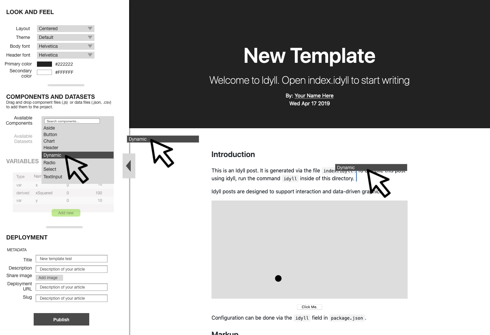
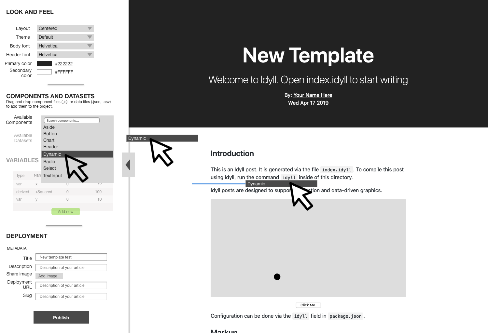
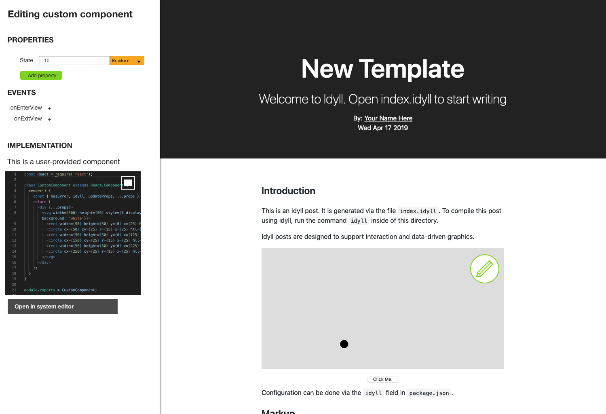
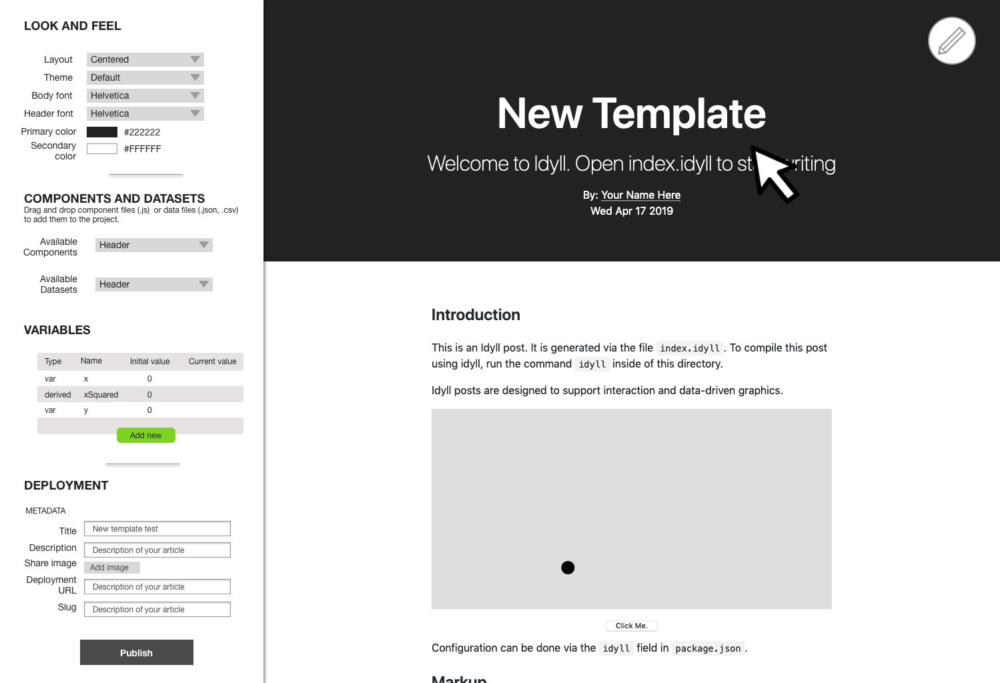

[Work in Progress]

# Idyll Desktop

Sketches towards an integrated dynamic publishing application.

## Mockup

# DEVELOPING

## Developing

### Getting the dependencies

1. First clone this repo
2. Run `npm install`
3. That should be it!

### Running in dev mode

`npm start`

### Running for production

TK...

### Deploying

TK...