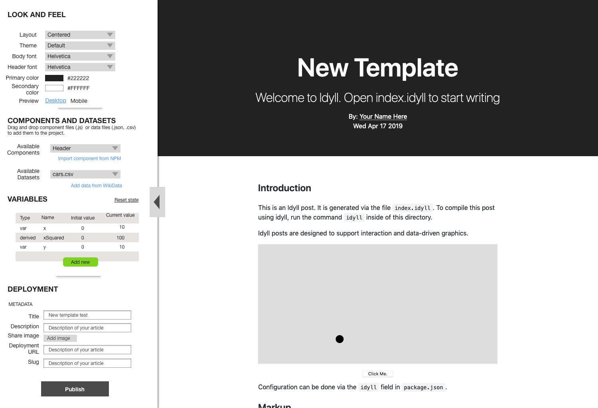
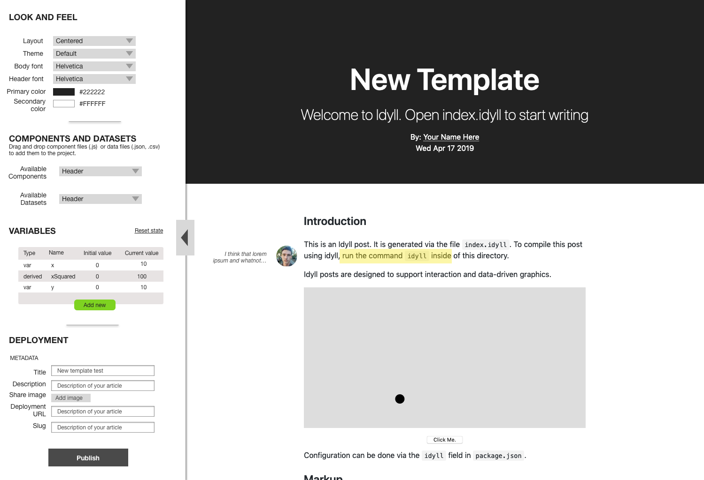
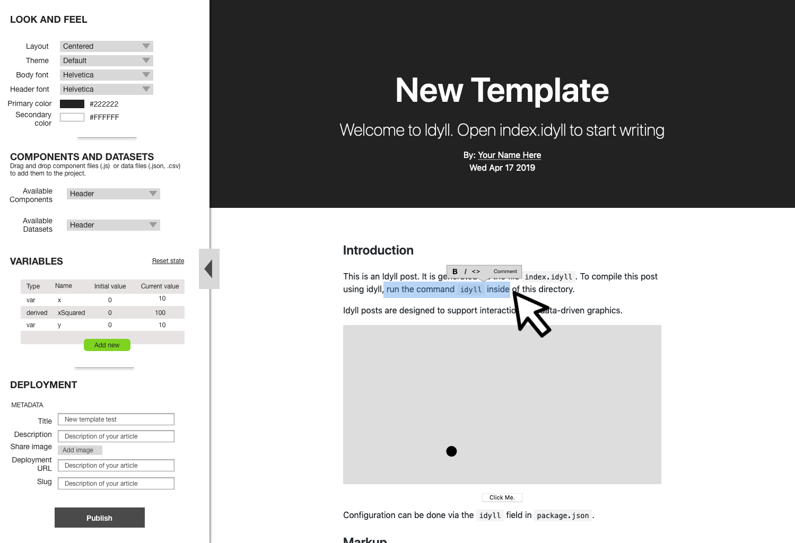
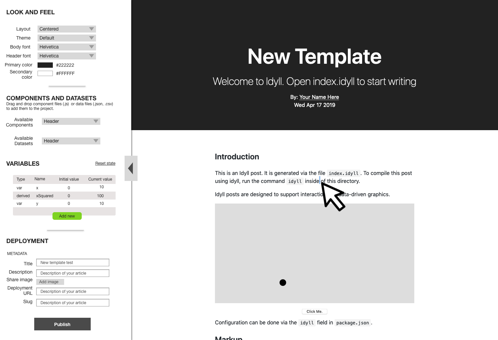
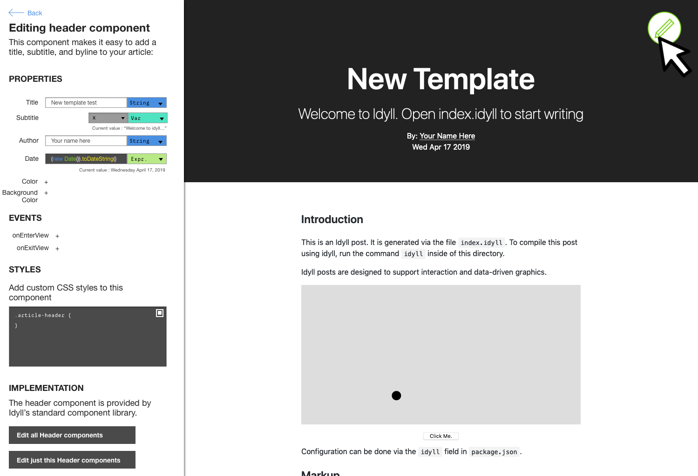

[Work in Progress]

# Idyll Studio

Sketches towards an integrated dynamic publishing application.

# DEVELOPING

See [CONTRIBUTING.md](./CONTRIBUTING.md)

## Mockup

_Note: The mocks are slightly out of date, as we now use tabs in the sidebar rather than listing variables components and datasets all in one view_

**Overview**

**Annotations**

**Text 1**

**Text 2**

**Adding component 1**

**Adding component 2**

**Custom component**

**Selecting a component**

**Component hover**

